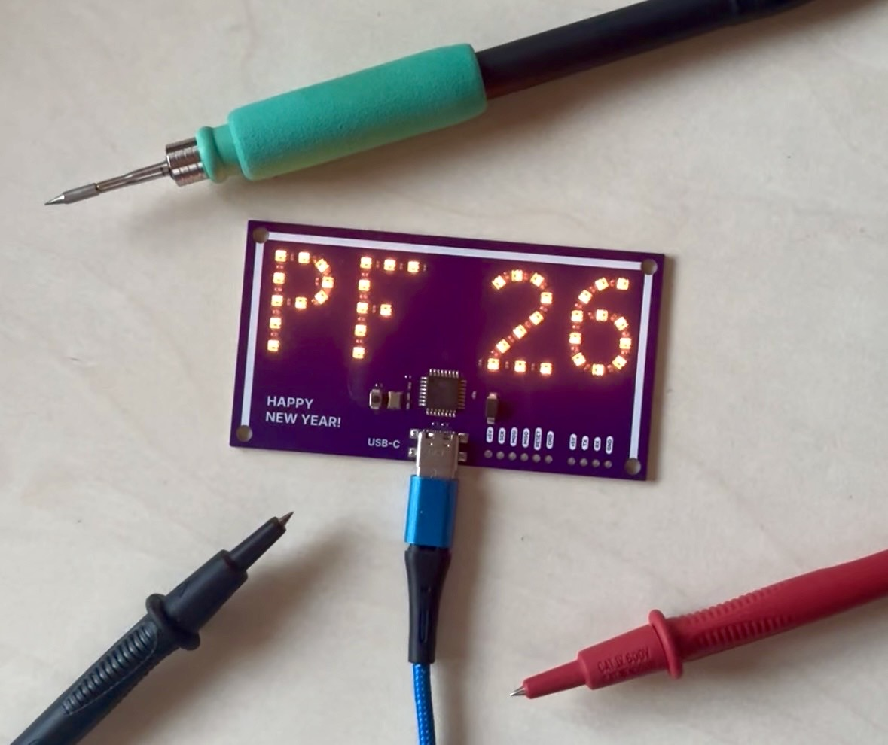

# PF 2026 - Sparkling LED Greeting Card

A custom-designed PCB created as a unique "Pour Féliciter 2026" (Happy New Year 2026) greeting card. The board features **39 individually addressable LEDs** arranged to form the text "PF 26", displaying a dynamic, warm fireworks sparkling effect.

This project is built around the **ATmega328P-AU** microcontroller, making it fully compatible with the Arduino ecosystem.

---

## 📷 Preview

*Finished and assembled PCB with the sparkling effect.*

---

## ⚡ Technical Specifications

* **MCU:** ATmega328P-AU (8-bit AVR, 16MHz external crystal).
* **LEDs:** 39x WS2812B-2020 (NeoPixel) in a single chain.
* **LED Pin:** Connected to **PD3** (Digital Pin **3** in Arduino IDE).
* **Interfaces:** * Standard **ICSP** header (for bootloader and ISP programming).
    * **UART** header (RX, TX, VCC, GND, DTR) for serial communication and programming.
* **Power:** 5V via USB-C connector (with 5.1k CC resistors for compatibility).

---

## 📂 Project Structure

The repository is divided into two main sections:

### 🛠️ [HW-PF-2026](./HW-PF-2026) (Hardware)
Contains all files necessary for PCB manufacturing and assembly:
* **KiCad Project:** Full schematic and PCB layout files.
* **Schematic:** PDF version for quick reference.
* **Manufacturing:** Gerbers and Drill files.
* **BOM:** Bill of Materials.

### 💻 [FW-PF-2026](./FW-PF-2026) (Firmware)
Contains the Arduino source code:
* **Sparkle Effect:** A gentle, warm-yellow "fireworks" animation with random 1-3 LED bursts and a dim static background.
* **Library dependency:** Requires the `Adafruit_NeoPixel` library.

---

## 🔌 Programming Guide

Since the board does not have an onboard USB-to-Serial converter, you can program it using an **Arduino UNO R3** as an ISP programmer.

### 1. Wiring (Arduino UNO to ICSP)

Connect your Arduino UNO to the ICSP header on the PF 2026 board as follows:

| Arduino UNO (Programmer) | PF 2026 (Target) |
| :--- | :--- |
| 5V | VCC |
| GND | GND |
| Pin 13 | SCK |
| Pin 12 | MISO |
| Pin 11 | MOSI |
| **Pin 10** | **RESET** |

### 2. Burning the Bootloader
1.  Open Arduino IDE.
2.  Go to **File -> Examples -> 11.ArduinoISP -> ArduinoISP** and upload it to your UNO.
3.  Go to **Tools -> Board** and select **Arduino Uno**.
4.  Go to **Tools -> Programmer** and select **Arduino as ISP**.
5.  Click **Tools -> Burn Bootloader**.

### 3. Uploading Firmware
1.  Open the sketch from the `/FW-PF-2026` folder.
2.  Go to **Sketch -> Upload Using Programmer** (or press `Ctrl+Shift+U`).

---

## 👤 Author
**Filip Flajšinger** Created for the 2026 New Year celebrations. 🥂